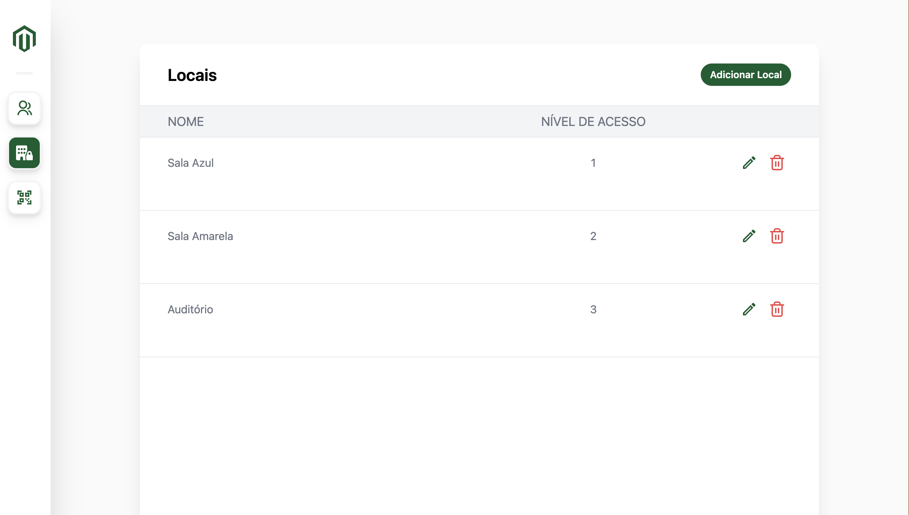

# 🚀 Sprint 4 – SafeCo™

----------

## 🛠️ Tecnologias

-   🧠 **TypeScript**
    
-   🔧 **NestJS**
    
-   🐘 **PostgreSQL**
    
-   🌿 **Prisma**
    
-   🐳 **Docker**
    

----------

## 🎯 Objetivo

A ideia desta sprint é simular um cenário realista: um cliente que já tem o **frontend pronto** e agora está buscando um time para desenvolver o **backend**.

O foco é **seguir todas as especificações passadas pelo cliente** para garantir que a integração entre as duas partes funcione perfeitamente, sem dores de cabeça 🧩.

Como estamos lidando com um projeto de escopo bem fechado, criamos várias **tarefas secundárias opcionais**. Conforme as funcionalidades principais forem sendo concluídas, cada equipe pode escolher um caminho diferente para evoluir o projeto — seja explorando uma nova funcionalidade ou caprichando em algum detalhe extra ✨.  
Esses pontos **não serão cobrados na entrega final**, então fiquem à vontade para explorar (ou não).

### 🏢 Sobre o Projeto

Trata-se de um sistema para **gerenciar o acesso e as permissões de pessoas dentro de uma empresa**.  
O objetivo principal é:

-   👥 Implementar um sistema de **gerenciamento de usuários**
    
-   🔐 Incluir **autenticação baseada em JWT**
    
-   🛡️ Controlar **permissões por nível de acesso**
    
-   📄 Gerar **relatórios em CSV e PDF**
    

A proposta é desenvolver um **backend funcional, seguro e bem estruturado** — pronto pra plugar no frontend do cliente e rodar sem sustos. 😎

----------

## 📌 Features Básicas

-   🧑‍💼 **CRUD de Usuários**

    
-   🏢 **CRUD de Locais**

    
-   ✅ **Validação de acesso do usuário ao local**
    
-   🔐 **Login**

-   🔑 **Autenticação com JWT**
    
-   🐘 **Banco PostgreSQL via Docker**
    

----------

## ⭐ Features Bônus (opcionais)

Estas funcionalidades são mais complexas e devem ser feitas **somente após a conclusão de todas as features básicas**:

-   🧾 Gerar **PDF ou CSV** com os usuários
    
-   🛡️ Validação com **Zod** ou **Class-Validator**
    
-   🚫 **Bloquear rotas com JWT**
    
-   🖼️ Guardar **foto de perfil em Base64**
    
-   🪪 Criar **crachá dinamicamente**
    
-   🚨 Quando o acesso a um local for negado, enviar **email aos usuários de nível 5**
    
-   ❓ Implementar **"Esqueci minha senha"**
    

----------

## 📚 Documentação e Tutoriais

> **Aprendam a ler a documentação!**  
> A do **NestJS** é excelente e muitas vezes melhor do que vários tutoriais por aí. 📖✨

### 📖 Documentações Oficiais

-   🐳 [Docker](https://www.docker.com/)
    
-   🐘 [PostgreSQL](https://www.postgresql.org/)
    
-   🔧 [NestJS](https://nestjs.com/)
    

### 🎥 Tutoriais Recomendados

-   ⚡ [NestJS in 100 Seconds](https://www.youtube.com/watch?v=0M8AYU_hPas)
    
-   🧑‍💻 [NestJs Course for Beginners - Create a REST API](https://www.youtube.com/watch?v=GHTA143_b-s&t=75s)
    
-   🐘🔗 [A combinação que todo dev back-end precisa saber (Postgres + Docker)](https://youtu.be/KlbL-8CEjN0)
----------

## 🖥️ Como rodar o Front

O cliente já forneceu um frontend pronto — e para facilitar os testes locais, também temos um **servidor mock** que simula o comportamento da API! 🚀

### 📁 Estrutura de Pastas

-   `./MockBackend` → Simula o servidor usando **json-server**
    
-   `./Frontend` → Aplicação **frontend** já pronta
    

----------

### 🔧 Rodando o Mock Backend

A pasta `MockBackend` usa o [`json-server`](https://github.com/typicode/json-server) para simular uma API real com base no arquivo `db.json`.

1.  Acesse a pasta:
    `cd MockBackend` 
    
2.  Instale as dependências:
    `npm install` 
    
3.  Rode o servidor mock:
    `npm run mock` 
    

🗃️ O arquivo `db.json` é usado como **banco de dados fake**, e o `json-server` cria rotas automáticas com base nesse conteúdo.  
➡️ **Dica:** Tente seguir as rotas do `json-server` (como `/users`, `/locations`, etc.) ao desenvolver seu backend real, para facilitar a integração com o front! 😉

----------

### 🌐 Rodando o Frontend

1.  Acesse a pasta:
    `cd Frontend` 
    
2.  Instale as dependências:
    `npm install` 
    
3.  Inicie o servidor de desenvolvimento:
    `npm run dev` 
    

✨ O frontend será iniciado em `http://localhost:3000` (ou conforme o terminal indicar) e espera que as rotas da API estejam prontas para responder!

----------

## Modelo de Usuário (User) 

| Campo       | Tipo               | Descrição                                       |
|-------------|--------------------|-------------------------------------------------|
| id          | UUID ou Int        | Identificador único                             |
| name        | string             | Nome do usuário                                 |
| email       | string             | Deve ser único e válido                         |
| password    | string             | Armazenada com hash e salt (bcrypt ou argon2)  |
| level       | int (1 a 5)        | Nível de acesso      
| profile_img       | string       | Imagem em Base64                                 |
| createdAt   | timestamp          | Gerado automaticamente                          |
| deletedAt   | timestamp          | Para deleção lógica                             |

## Modelo de Sala (Room)

| Campo          | Tipo            | Descrição                                        |
|----------------|------------------|--------------------------------------------------|
| id             | UUID ou Int      | Identificador único                              |
| description           | string           | Nome da sala                                     |
| acessLevel  | int              | Nível mínimo necessário para entrar                              |

## Funcionalidades Recomendadas (Mínimas)

### 1. CRUD de Usuários

| Função               | Rota             | Acesso                                | Observações                                                        |
|----------------------|------------------|----------------------------------------|---------------------------------------------------------------------|
| Criar Usuário        | POST /users      | Nível 5                    | Nome, email, senha (hash), nível                                   |
| Listar Usuários      | GET /users       | Autenticado                            | Lista todos os usuários                                            |
| Buscar por ID        | GET /users/:id   | Autenticado                            | Retorna dados de um usuário específico                             |
| Atualizar Usuário    | PATCH /users/:id | O próprio ou nível 5                   | Apenas nível 5 pode alterar nível                                  |
| Deletar Usuário      | DELETE /users/:id| Nível 4 ou 5                            | Deleção lógica (marca `deletedAt`)                                 |

### 2. Controle de Nível

| Função                  | Rota                    | Acesso           | Observações                             |
|-------------------------|--------------------------|------------------|------------------------------------------|
| Atualizar Nível de Acesso | PATCH /users/:id/level | Somente nível 5 | Define novo nível entre 1 a 5            |

### 3. Autenticação e Segurança

| Função                    | Rota               | Acesso           | Observações                              |
|---------------------------|--------------------|------------------|-------------------------------------------|
| Login                     | POST /auth/login   | Público          | Gera token JWT com email e senha válidos |
| Middleware de Autenticação| -                  | Todas as rotas   | Verifica token JWT                       |
| Middleware de Autorização| -                  | Rotas sensíveis  | Verifica `level` do usuário              |

### 4. CRUD de Salas

| Função                   | Rota                  | Acesso           | Observações                                               |
|--------------------------|-----------------------|------------------|------------------------------------------------------------|
| Criar Sala               | POST /room            | Autenticado      | Somente nível 5                                            |
| Editar Sala              | PUT /room/:id         | Nível 5          | Pode alterar `name` e `request_level`                     |
| Listar Salas             | GET /rooms            | Autenticado      | Lista todas com id, nome e nível                          |
| Buscar Sala por ID       | GET /room/:id         | Autenticado      | Retorna dados da sala                                     |
| Bloquear/Desbloquear Sala| PATCH /room/:id       | Somente nível 5  | Alterna `is_blocked`                                      |

## 🔒 Controle Obrigatório por Nível (Role)

- Toda rota deve verificar autenticação via JWT
- Verificar `level` via middleware centralizado
- Restrições por `level`:
  - 1 = Usuário comum
  - 2 a 4 = Intermediários
  - 5 = Admin (acesso total)
- Falha na autorização = Erro 403 (Forbidden)

## Funcionalidades Opcionais

### 5. Relatórios

| Função                | Rota        | Acesso       | Saída                        |
|-----------------------|-------------|--------------|-------------------------------|
| Gerar Relatório       | GET /report | Autenticado  | Escolha entre CSV ou PDF      |

### 6. Simulação de Entrada em Sala

| Função                | Rota              | Acesso       | Regras                                                                 |
|-----------------------|-------------------|--------------|------------------------------------------------------------------------|
| Tentar Entrar em Sala | POST /room/enter  | Autenticado  | Verifica nível vs `request_level` da sala                             |
|                       |                   |              | Se acesso negado: erro 403 e mensagem "Nível insuficiente" etc.       |
|                       |                   |              | Opcional: logar tentativa em tabela auxiliar (acessos)                |

### 7. Geração de Crachá

| Função             | Rota               | Acesso       | Descrição                                                                 |
|--------------------|--------------------|--------------|---------------------------------------------------------------------------|
| Gerar Crachá       | POST /badge/:id    | Autenticado  | Gera PDF com Nome, Email, Nível, Data de criação e foto (BASE64)         |
|                    |                    |              | Opcional: incluir QR Code com ID do usuário                              |

## 🔥 Desafios Extras

- Ao tentar entrar em sala sem permissão, enviar e-mail para todos os usuários com nível 5
  - Incluir: nome da sala, hora da tentativa, ID do usuário
  - Testar com https://www.fakemail.net/

## Backlog Técnico

📌 Configuração Inicial

- [ ] Estrutura do projeto com NestJS
- [ ] Configuração do Prisma + PostgreSQL
- [ ] Docker para ambiente local
- [ ] Modelagem de `User` e `Room`
- [ ] Hash de senha segura

📌 CRUD de Usuário

- [ ] Rotas, serviços, repositórios
- [ ] Middleware de autorização por `level`
- [ ] Validações com `class-validator`

📌 CRUD de Sala

- [ ] Rotas, serviços, repositórios

📌 Autenticação

- [ ] Login + JWT
- [ ] Middleware de token
- [ ] Middleware de autorização

📌 Relatórios

- [ ] CSV (`csv-writer`, `fast-csv`)
- [ ] PDF (`pdfkit`, `puppeteer`)
- [ ] Rota /report

📌 Testes e Documentação (Opcional)

- [ ] Testes com Jest
- [ ] Documentação com Swagger

## ✅ Definition of Done (DoD)

- Todas rotas funcionando
- Regras de autenticação e autorização aplicadas
- Senhas hasheadas com segurança
- Testes/documentação se possível
